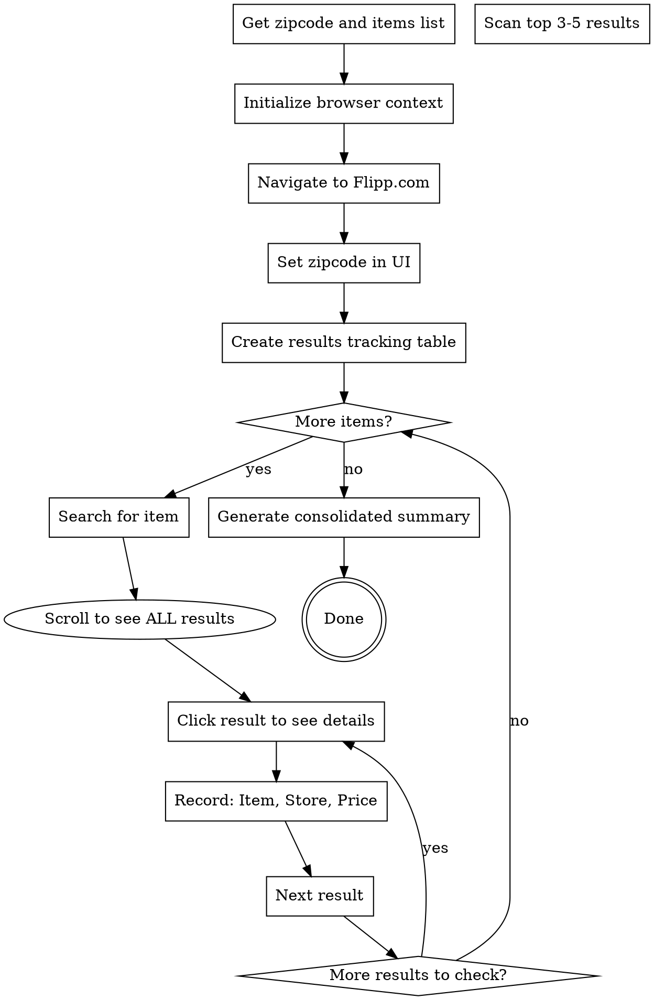

# Flipp Deal Finder

## Overview

Systematic workflow for finding and consolidating the cheapest grocery deals across multiple items on Flipp.com using Chrome automation. Addresses the challenge that store names are hidden in search results and only revealed in item detail modals.

## When to Use

- User wants to compare prices for multiple grocery items on Flipp.com
- Need to find cheapest store for each item
- Consolidating deals across stores for shopping trip planning

**Don't use for:**
- Single item lookups (just do direct search)
- Other deal sites besides Flipp.com

## Workflow



## Quick Reference

| Step | Action | Chrome Tool |
|------|--------|-------------|
| 1. Initialize | Get browser context | `tabs_context_mcp(createIfEmpty: true)` |
| 2. Navigate | Go to Flipp.com | `navigate(url: "https://flipp.com")` |
| 3. Set location | Click zipcode dropdown, enter zipcode | `find()` → `form_input()` or `computer(type)` |
| 4. Search item | Type in search box, press Enter | `find()` → `form_input()` or `computer(type)` |
| 5. **Scroll ALL results** | **Scroll to see complete list** | **`computer(scroll, direction: "down")`** |
| 6. Get details | Click result cards to open modals | `computer(left_click)` on multiple results |
| 7. Extract data | Read store name and price from modal | `read_page()` or screenshot analysis |
| 8. Track results | Maintain markdown table internally | In-memory tracking |

## Implementation

### 1. Browser Setup

**ALWAYS start with:** `tabs_context_mcp(createIfEmpty: true)`

This gets existing tabs or creates new browser context.

### 2. Results Tracking Structure

Track findings in a markdown table:

```markdown
| Item | Store | Price | Notes |
|------|-------|-------|-------|
| Milk (whole, gallon) | Sam's Club | $3.32 | Member's Mark brand |
| Milk (whole, gallon) | CVS Pharmacy | $3.99 | Producers Dairy |
| Eggs (dozen) | Butera | $1.49 | Grade A Large |
```

### 3. Item Detail Extraction Pattern

**Critical:** Store names ONLY appear when you click into item details modal

```javascript
// After clicking a result card:
// Modal opens with:
// - Store logo and name at top
// - Price (large text)
// - Product description
// - SKU

// Use read_page() to extract or analyze screenshot
```

### 4. Consolidation Output

Generate final summary showing cheapest option per item:

```markdown
**Cheapest Deals for 60645:**

1. **Milk (whole, gallon)** - Sam's Club at $3.32
2. **Eggs (dozen)** - Butera at $1.49
3. **Bread (whole wheat)** - Jewel-Osco at $2.99

**Shopping Strategy:**
- If you have Sam's Club membership: Get milk there ($3.32)
- Visit Butera for eggs ($1.49)
- Visit Jewel-Osco for bread ($2.99)
```

## Common Mistakes

| Mistake | Fix |
|---------|-----|
| Assuming store names visible in search results | Always click into item details modal to see store |
| **Stopping after first screen of results** | **CRITICAL: Scroll through ALL results. Best deals often require scrolling. Check at least 8-10 items minimum, more if available** |
| Checking only first result | Check multiple results across all visible options |
| Not tracking results systematically | Use markdown table to avoid losing data |
| Forgetting to set zipcode | Verify zipcode is set before searching |
| Mixing up items when switching searches | Label each entry clearly in tracking table |
| Not consolidating final results | Generate clear "cheapest per item" summary |

## Browser Automation Tips

**Finding elements:**
- Use `find(query: "search box")` for natural language element finding
- Use `read_page(filter: "interactive")` to see clickable elements

**Entering data:**
- `form_input()` for form fields with ref IDs
- `computer(type: "text")` after clicking search box

**Modals:**
- Click result → modal opens automatically
- Close modal: look for X button, click outside, or press Escape

**Scrolling:**
- **CRITICAL:** Always scroll down to see ALL search results before concluding
- Use `computer(scroll, direction: "down")` to reveal more items
- Best deals are often NOT in the first few visible results
- Check count indicator (e.g., "Items 20" means 20 results to review)

**Screenshots:**
- Take screenshots when debugging layout issues
- Use `computer(screenshot)` to verify zipcode is set correctly
